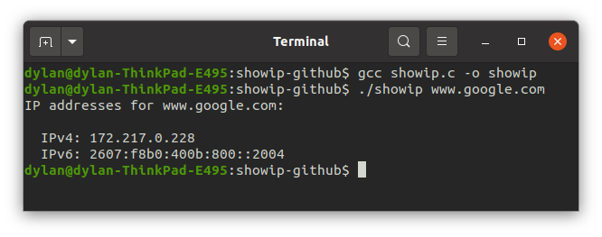

# 👁️ Showip

Show available ips of a host.

First practice project of trying to learn game network programming.

Made from following [Beej's Guide to Network Programming](http://beej.us/guide/bgnet/html/#structs).

# Run

1. compile `gcc showip.c -o showip`
1. run `./showip www.google.com`